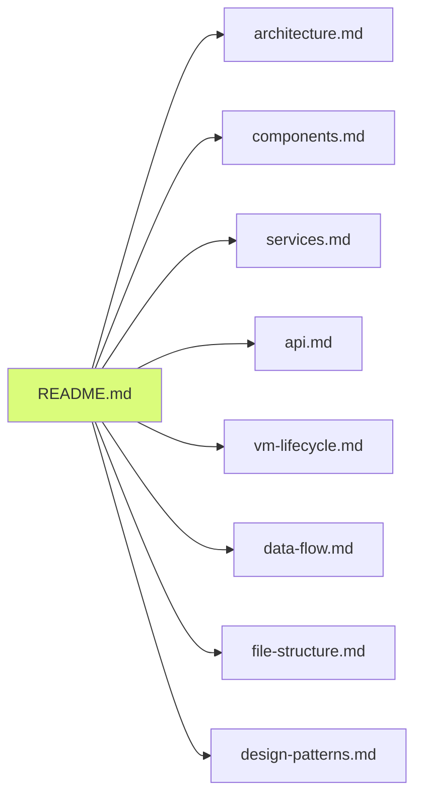

# Cyber Workbench Documentation

Welcome to the Cyber Workbench documentation! This documentation uses **visual diagrams** to show how the system works.

## Documentation Structure

All documentation follows the **OOP, KISS, and Modularity** principles of the codebase.

### Core Documentation

### Documentation Files

1. **[architecture.md](./architecture.md)** - System architecture, layer separation, component hierarchy
2. **[components.md](./components.md)** - Component inheritance, communication, lifecycle
3. **[services.md](./services.md)** - Service layer patterns, registry, methods
4. **[api.md](./api.md)** - API routes, request flow, Python bridge
5. **[vm-lifecycle.md](./vm-lifecycle.md)** - VM states, creation workflow, progress tracking
6. **[data-flow.md](./data-flow.md)** - Data models, transformations, state management
7. **[file-structure.md](./file-structure.md)** - Repository layout, module dependencies
8. **[design-patterns.md](./design-patterns.md)** - OOP principles, KISS, modularity patterns

## How to Use

1. **Start with [architecture.md](./architecture.md)** for system overview
2. **Review [components.md](./components.md)** to understand UI structure
3. **Check [services.md](./services.md)** for business logic patterns
4. **See [api.md](./api.md)** for backend API structure
5. **Follow [vm-lifecycle.md](./vm-lifecycle.md)** for VM operations
6. **Reference [file-structure.md](./file-structure.md)** for code organization

## Maintenance

**⚠️ IMPORTANT**: These documentation files use Mermaid diagrams and must be kept synchronized with the codebase.

When making code changes:
- Update relevant diagram files
- Keep diagrams accurate and current
- Add new diagrams for new features
- Remove outdated diagrams

See `.cursorrules` for detailed maintenance guidelines.

## Access

- **Web UI**: http://localhost:3000
- **Documentation**: http://localhost:3000/docs
- **API**: http://localhost:3000/api
