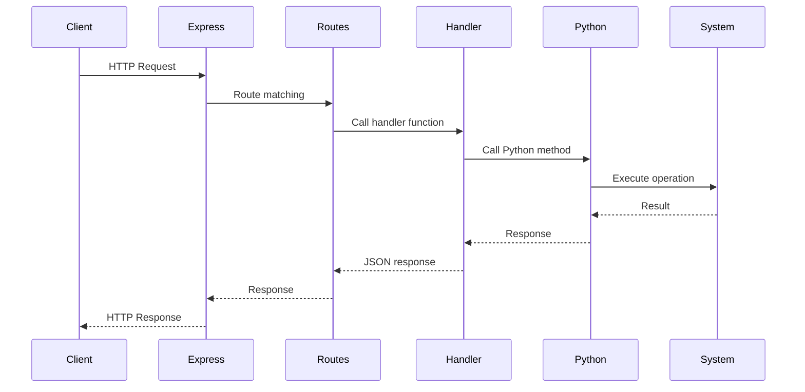
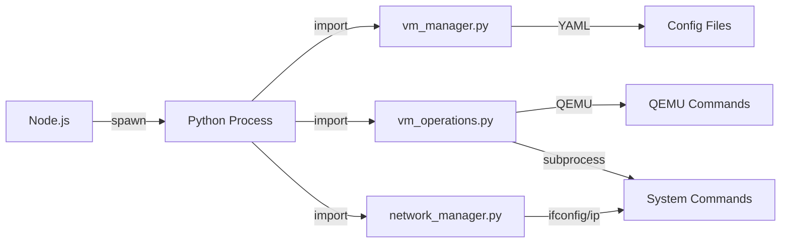
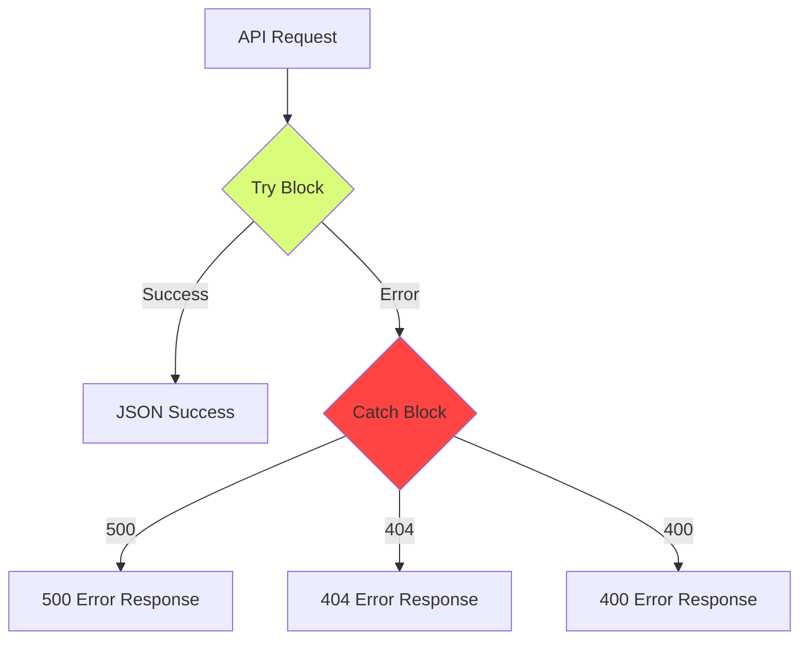

# API Architecture

## API Route Structure

```mermaid
graph TB
    Express[Express Server] --> Routes[setupRoutes]
    Routes --> VMRoutes[VM Routes]
    Routes --> EnvRoutes[Environment Routes]
    Routes --> DocRoutes[Documentation Routes]
    
    VMRoutes --> List[GET /vms]
    VMRoutes --> Get[GET /vms/:name]
    VMRoutes --> Create[POST /vms]
    VMRoutes --> Update[PUT /vms/:name]
    VMRoutes --> Delete[DELETE /vms/:name]
    VMRoutes --> Start[POST /vms/:name/start]
    VMRoutes --> Stop[POST /vms/:name/stop]
    VMRoutes --> Status[GET /vms/:name/status]
    VMRoutes --> Viewer[GET /vms/:name/viewer-port]
    VMRoutes --> Progress[GET /vms/:name/progress]
    VMRoutes --> Disk[POST /vms/:name/create-disk]
    VMRoutes --> ISO[POST /vms/:name/download-iso]
    VMRoutes --> Prepare[POST /vms/:name/prepare-iso]
    
    EnvRoutes --> EnvList[GET /environments]
    EnvRoutes --> EnvGet[GET /environments/:name]
    EnvRoutes --> EnvCreate[POST /environments]
    EnvRoutes --> EnvUpdate[PUT /environments/:name]
    EnvRoutes --> EnvDelete[DELETE /environments/:name]
    EnvRoutes --> EnvStart[POST /environments/:name/start]
    EnvRoutes --> EnvStop[POST /environments/:name/stop]
    EnvRoutes --> EnvProgress[GET /environments/:name/progress]
    
    DocRoutes --> DocList[GET /docs/list]
    DocRoutes --> DocContent[GET /docs/content/:path]
```

## Request Processing Flow

## Python Bridge

## Environment Start Networking Behavior

- **Bridge/TAP when available**: environment services can request an environment network; the backend will try to create a TAP and attach it to the bridge.
- **Graceful fallback**: if TAP cannot be created (common on macOS without a TAP driver), the backend **falls back to QEMU user-mode networking** and returns **warnings** in:
  - the **HTTP response** from `POST /environments/:name/start` (`warnings: string[]`)
  - the **progress payload** (`GET /environments/:name/progress`, `progress.warnings`)
  - the environment YAML as `lastStartWarnings`

## Error Handling

