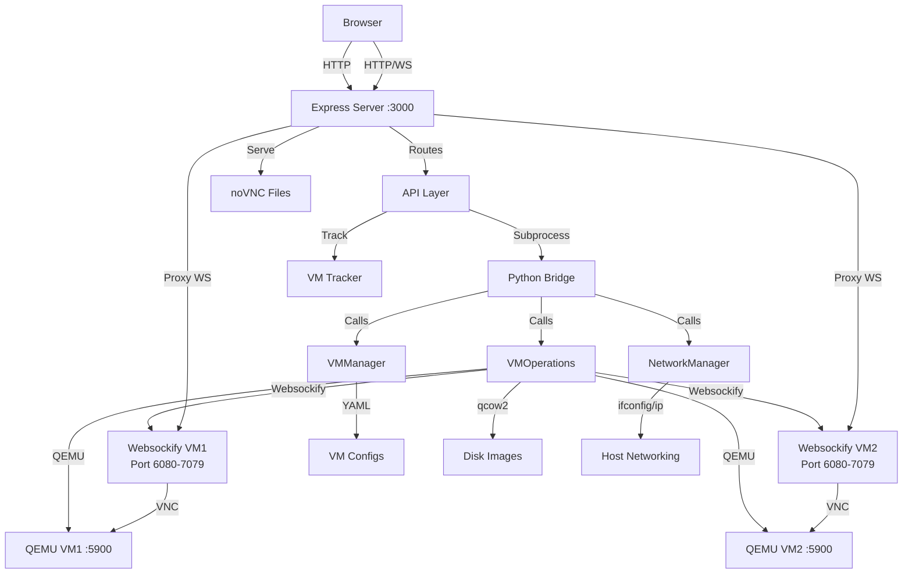
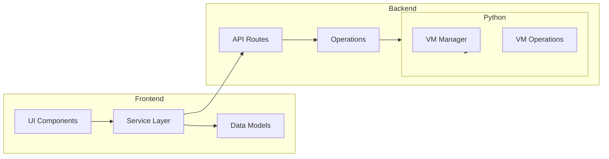
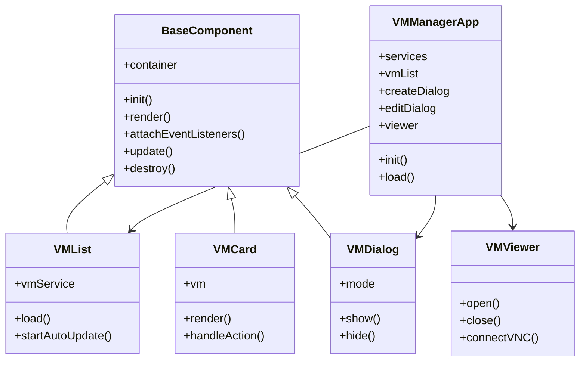
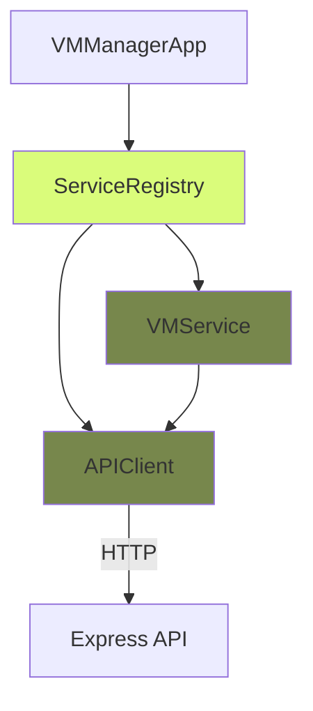
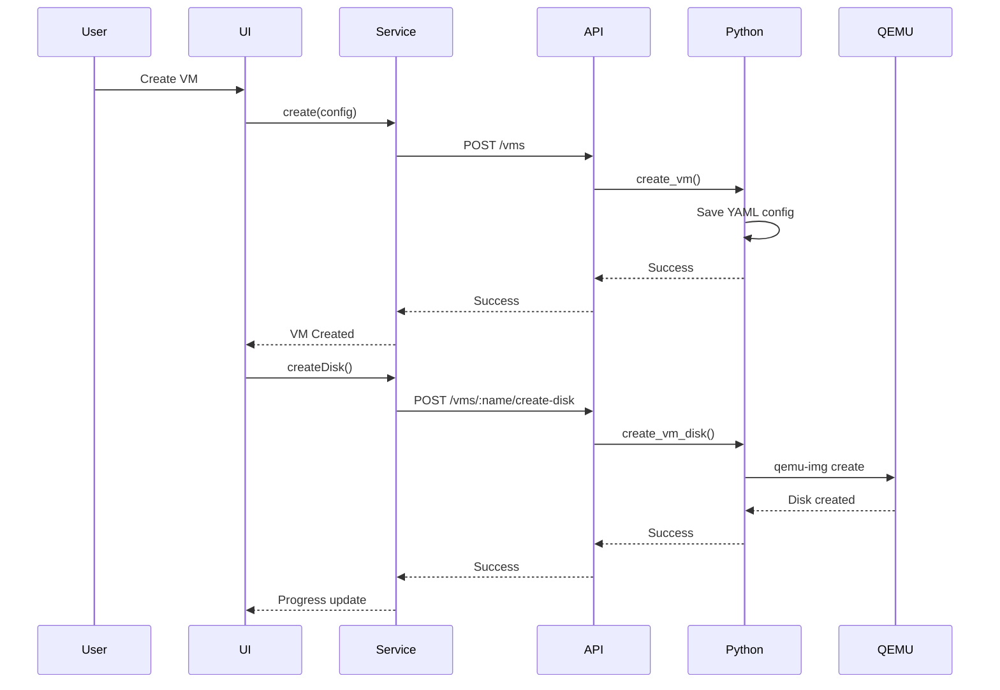
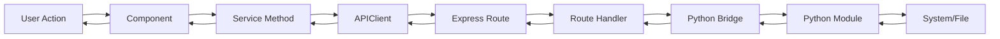

# Architecture Overview

## System Architecture



## Layer Separation



## Component Hierarchy



## Service Layer Pattern



## Data Flow: VM Creation



## Request Flow



## File Structure

```
cyber_workbench/
├── web-ui/                    # Frontend + Backend
│   ├── api/                   # Express API routes
│   │   ├── routes.js          # Route definitions
│   │   ├── vm.js              # VM endpoints
│   │   ├── operations.js      # VM operations wrapper
│   │   ├── docs.js            # Documentation API
│   │   ├── python-bridge.js   # Python subprocess bridge
│   │   ├── nginx-manager.js   # nginx process management
│   │   ├── vm-tracker.js      # VM tracking & lifecycle
│   │   └── progress.js        # Progress tracking
│   ├── public/                # Static files
│   │   ├── js/
│   │   │   ├── app.js         # Main app orchestrator
│   │   │   ├── components/    # UI components
│   │   │   ├── services/      # Service layer
│   │   │   ├── models/        # Data models
│   │   │   ├── core/          # Core utilities
│   │   │   └── viewer.js      # VM viewer (noVNC)
│   │   └── css/               # Styles
│   └── server.js              # Express server
├── nginx/                     # nginx configuration
│   ├── novnc.conf            # Active nginx config (generated)
│   ├── novnc.conf.template   # Template for config generation
│   ├── nginx.pid             # nginx PID file
│   └── vm-tracker.json       # VM tracking state
├── vm_manager.py             # Python: Config management
├── vm_operations.py           # Python: QEMU operations
└── docs/                     # Documentation
```

