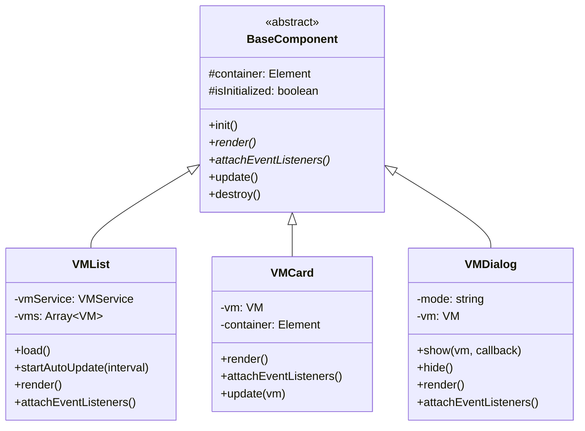
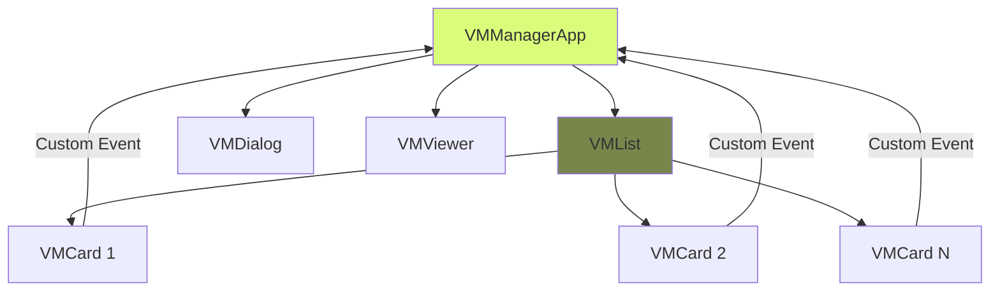
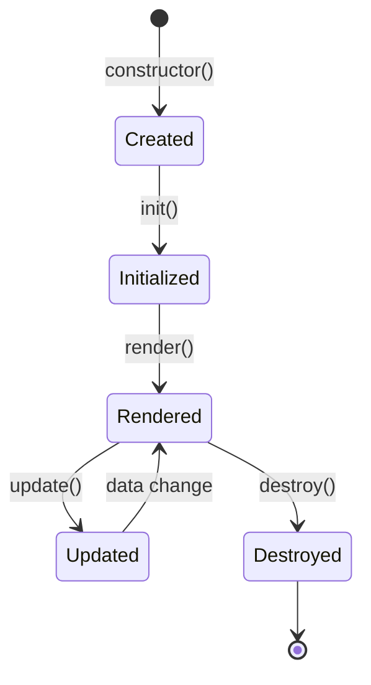
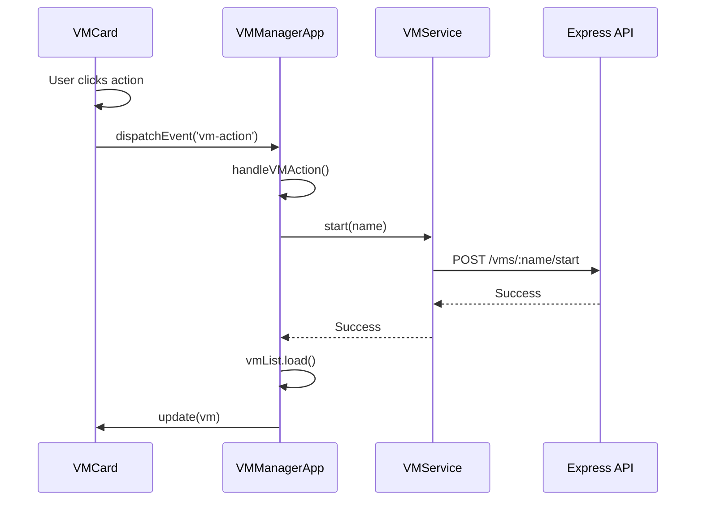

# Component Architecture

## Component Inheritance

```mermaid
classDiagram
    class BaseComponent {
        <<abstract>>
        #container: Element
        #isInitialized: boolean
        +init()
        +render()*
        +attachEventListeners()*
        +update()
        +destroy()
    }
    
    class VMList {
        -vmService: VMService
        -vms: Array~VM~
        +load()
        +startAutoUpdate(interval)
        +render()
        +attachEventListeners()
    }
    
    class VMCard {
        -vm: VM
        -container: Element
        +render()
        +attachEventListeners()
        +update(vm)
    }
    
    class VMDialog {
        -mode: string
        -vm: VM
        +show(vm, callback)
        +hide()
        +render()
        +attachEventListeners()
    }
    
    BaseComponent <|-- VMList
    BaseComponent <|-- VMCard
    BaseComponent <|-- VMDialog
```

## Component Communication

```mermaid
graph TB
    App[VMManagerApp] --> List[VMList]
    List --> Card1[VMCard 1]
    List --> Card2[VMCard 2]
    List --> CardN[VMCard N]
    
    Card1 -->|Custom Event| App
    Card2 -->|Custom Event| App
    CardN -->|Custom Event| App
    
    App --> Dialog[VMDialog]
    App --> Viewer[VMViewer]
    
    style App fill:#dafc7b
    style List fill:#77874c
```

## Component Lifecycle

```mermaid
stateDiagram-v2
    [*] --> Created: constructor()
    Created --> Initialized: init()
    Initialized --> Rendered: render()
    Rendered --> Updated: update()
    Updated --> Rendered: data change
    Rendered --> Destroyed: destroy()
    Destroyed --> [*]
```

## Event Flow

```mermaid
sequenceDiagram
    participant Card as VMCard
    participant App as VMManagerApp
    participant Service as VMService
    participant API as Express API
    
    Card->>Card: User clicks action
    Card->>App: dispatchEvent('vm-action')
    App->>App: handleVMAction()
    App->>Service: start(name)
    Service->>API: POST /vms/:name/start
    API-->>Service: Success
    Service-->>App: Success
    App->>App: vmList.load()
    App->>Card: update(vm)
```

