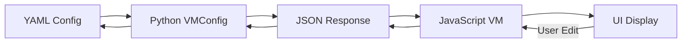
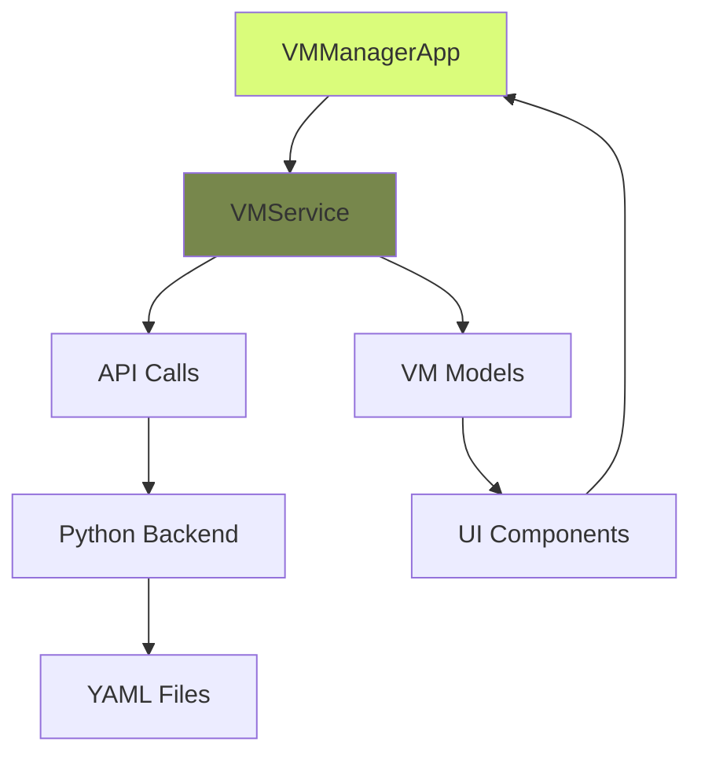
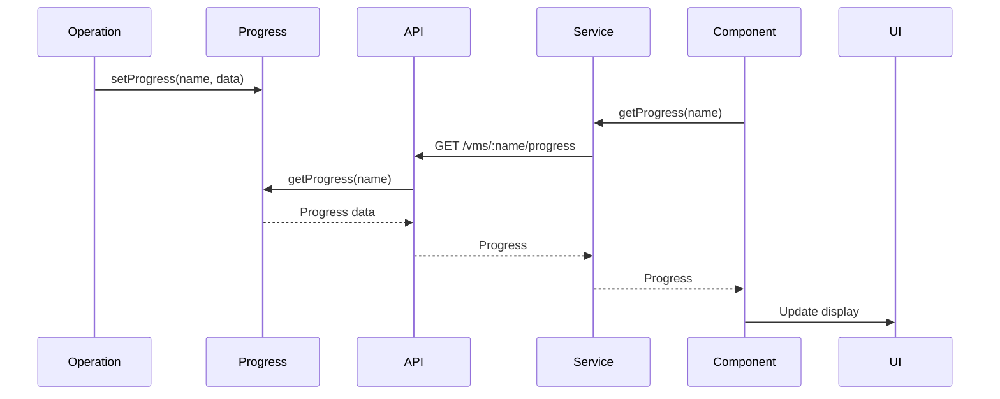
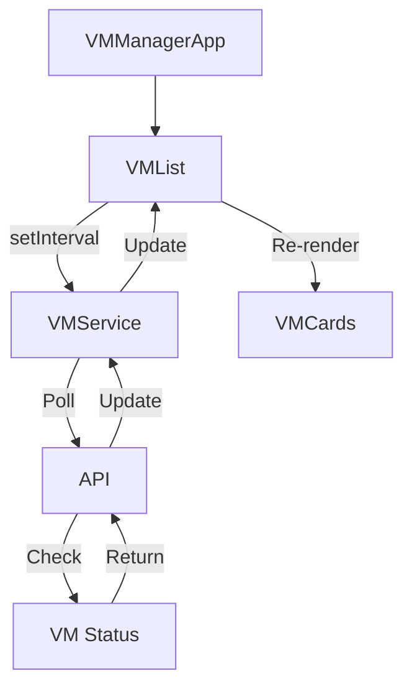

# Data Flow

## VM Model Structure

```mermaid
classDiagram
    class VM {
        +name: string
        +cpu_cores: number
        +ram_gb: number
        +disk_size_gb: number
        +network: string
        +created: string
        +running: boolean
        +progress: object
        +status: string
        +statusText: string
        +isProcessing(): boolean
    }
    
    class VMConfig {
        +name: string
        +cpu_cores: int
        +ram_gb: int
        +disk_size_gb: int
        +network: string
        +created: string
        +to_dict(): dict
        +from_dict(): VMConfig
    }
    
    VM -->|Serialized| YAML[config.yaml]
    VMConfig -->|Serialized| YAML
```

## Environment Model Notes

Environments persist informational metadata about the most recent start attempt:

- `lastStartWarnings: string[]` (warnings emitted when falling back from TAP/bridge networking to user-mode, or when environment networks fail to create)
- `lastStartedAt: string | null` (timestamp of last successful start)

## Data Transformation Flow



## State Management



## Progress Data Flow



## Real-time Updates



