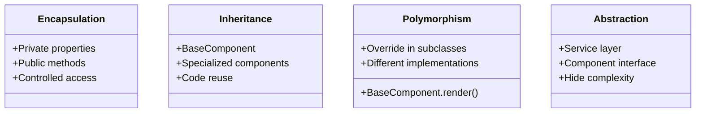
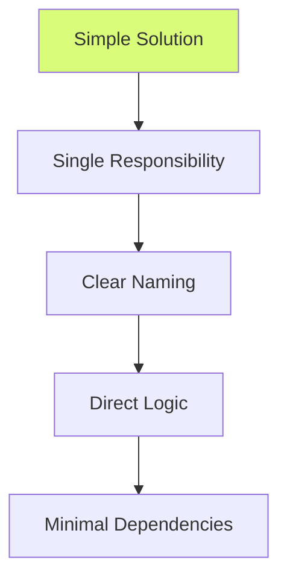
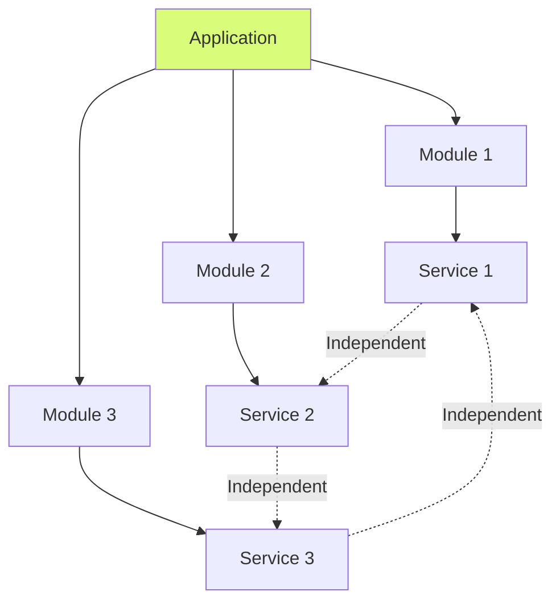
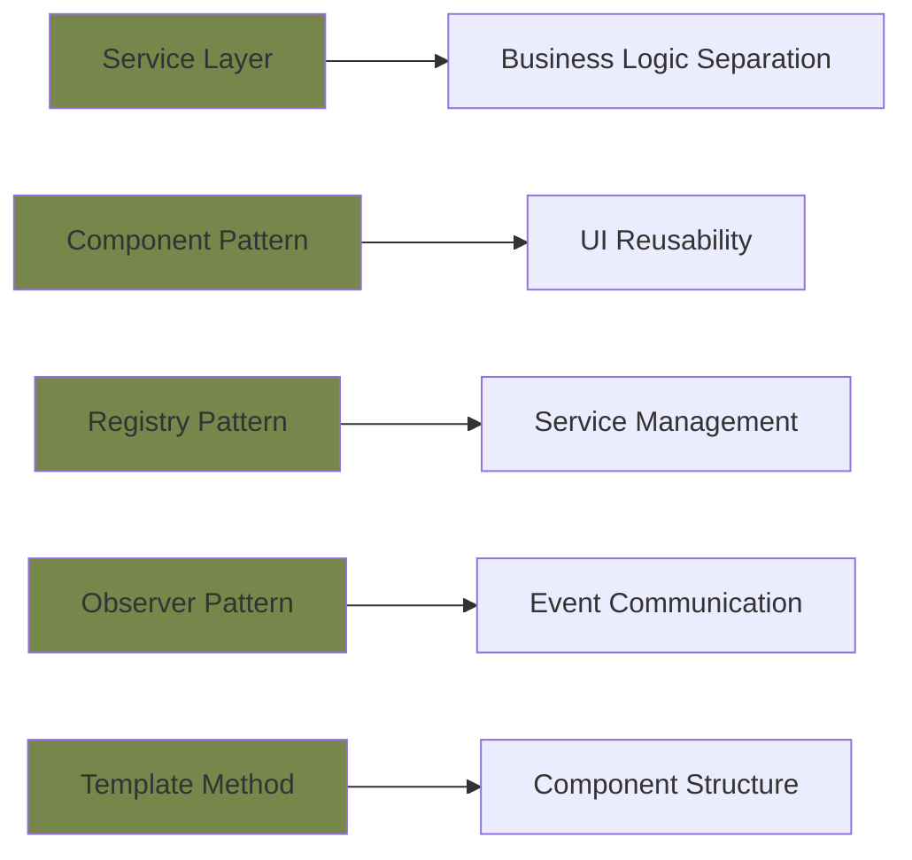
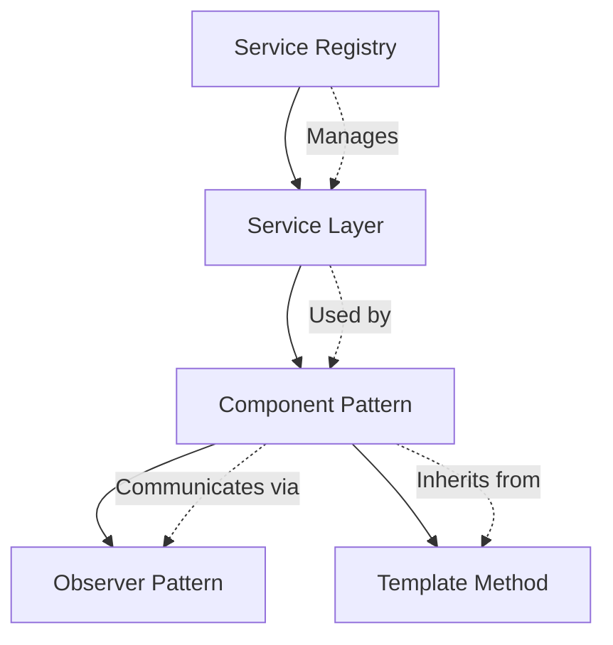

# Design Patterns

## OOP Principles

```mermaid
classDiagram
    class Encapsulation {
        +Private properties
        +Public methods
        +Controlled access
    }
    
    class Inheritance {
        +BaseComponent
        +Specialized components
        +Code reuse
    }
    
    class Polymorphism {
        +BaseComponent.render()
        +Override in subclasses
        +Different implementations
    }
    
    class Abstraction {
        +Service layer
        +Component interface
        +Hide complexity
    }
```

## KISS Principle

```mermaid
graph TB
    Simple[Simple Solution] --> Focus[Single Responsibility]
    Focus --> Clear[Clear Naming]
    Clear --> Direct[Direct Logic]
    Direct --> Minimal[Minimal Dependencies]
    
    style Simple fill:#dafc7b
```

## Modularity

```mermaid
graph TB
    App[Application] --> Module1[Module 1]
    App --> Module2[Module 2]
    App --> Module3[Module 3]
    
    Module1 --> Service1[Service 1]
    Module2 --> Service2[Service 2]
    Module3 --> Service3[Service 3]
    
    Service1 -.->|Independent| Service2
    Service2 -.->|Independent| Service3
    Service3 -.->|Independent| Service1
    
    style App fill:#dafc7b
```

## Patterns Used

```mermaid
graph LR
    A[Service Layer] --> B[Business Logic Separation]
    C[Component Pattern] --> D[UI Reusability]
    E[Registry Pattern] --> F[Service Management]
    G[Observer Pattern] --> H[Event Communication]
    I[Template Method] --> J[Component Structure]
    
    style A fill:#77874c
    style C fill:#77874c
    style E fill:#77874c
    style G fill:#77874c
    style I fill:#77874c
```

## Pattern Relationships

```mermaid
graph TB
    Registry[Service Registry] --> Service[Service Layer]
    Service --> Component[Component Pattern]
    Component --> Observer[Observer Pattern]
    Component --> Template[Template Method]
    
    Registry -.->|Manages| Service
    Service -.->|Used by| Component
    Component -.->|Communicates via| Observer
    Component -.->|Inherits from| Template
```

