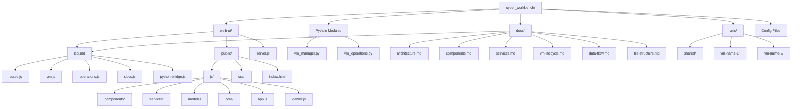
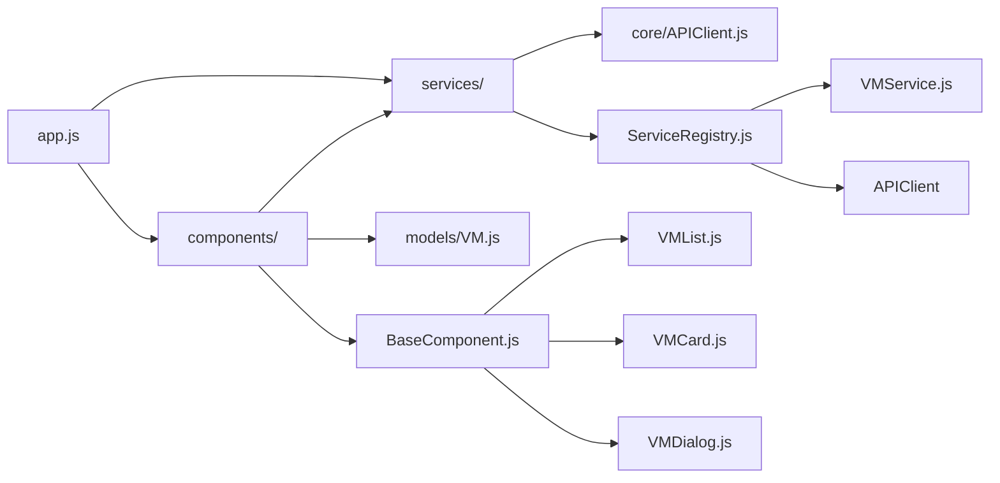
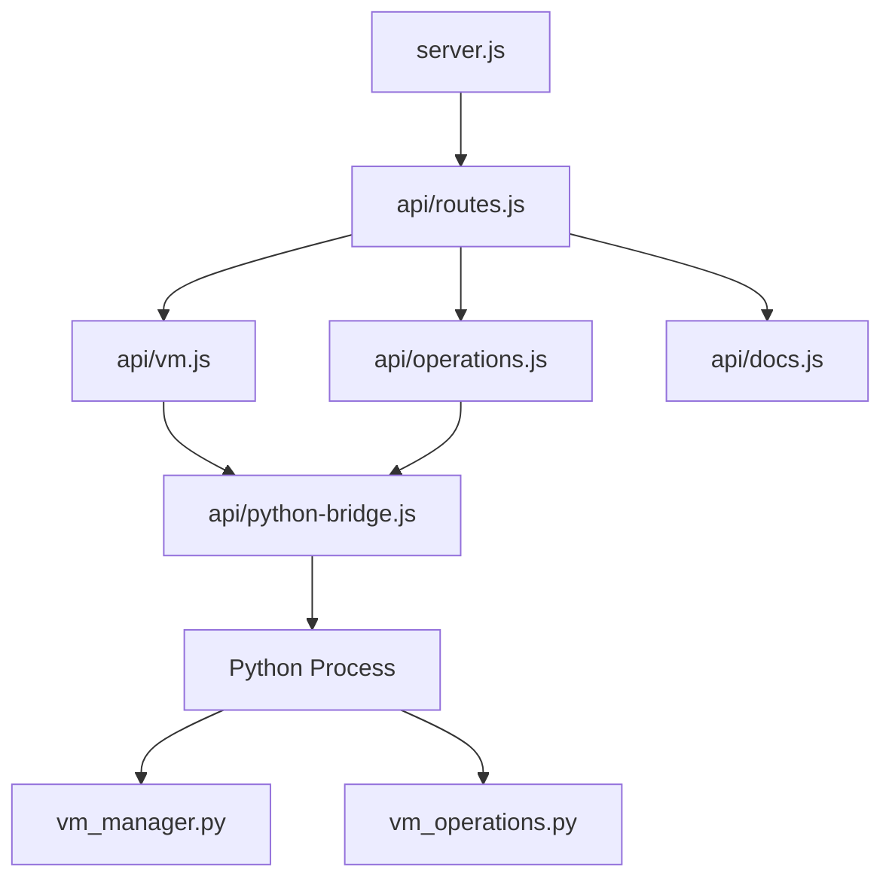
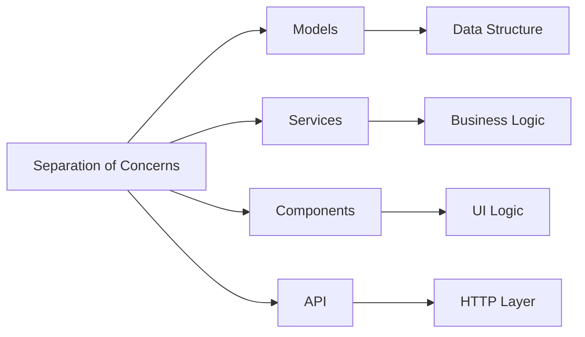

# File Structure

## Repository Layout

```mermaid
graph TB
    Root[cyber_workbench/] --> WebUI[web-ui/]
    Root --> Python[Python Modules]
    Root --> Docs[docs/]
    Root --> VMs[vms/]
    Root --> Config[Config Files]
    
    WebUI --> API[api/]
    WebUI --> Public[public/]
    WebUI --> Server[server.js]
    
    API --> Routes[routes.js]
    API --> VMAPI[vm.js]
    API --> Ops[operations.js]
    API --> DocsAPI[docs.js]
    API --> Bridge[python-bridge.js]
    
    Public --> JS[js/]
    Public --> CSS[css/]
    Public --> HTML[index.html]
    
    JS --> Components[components/]
    JS --> Services[services/]
    JS --> Models[models/]
    JS --> Core[core/]
    JS --> App[app.js]
    JS --> Viewer[viewer.js]
    
    Python --> VMMgr[vm_manager.py]
    Python --> VMOps[vm_operations.py]
    
    Docs --> Arch[architecture.md]
    Docs --> Comp[components.md]
    Docs --> Serv[services.md]
    Docs --> API[api.md]
    Docs --> Lifecycle[vm-lifecycle.md]
    Docs --> DataFlow[data-flow.md]
    Docs --> FileStruct[file-structure.md]
    
    VMs --> Shared[shared/]
    VMs --> VM1[vm-name-1/]
    VMs --> VM2[vm-name-2/]
```

## Module Dependencies

```mermaid
graph LR
    App[app.js] --> Services[services/]
    App --> Components[components/]
    Services --> Core[core/APIClient.js]
    Components --> Services
    Components --> Models[models/VM.js]
    
    Services --> ServiceRegistry[ServiceRegistry.js]
    ServiceRegistry --> VMService[VMService.js]
    ServiceRegistry --> APIClient
    
    Components --> BaseComponent[BaseComponent.js]
    BaseComponent --> VMList[VMList.js]
    BaseComponent --> VMCard[VMCard.js]
    BaseComponent --> VMDialog[VMDialog.js]
```

## Backend Dependencies

```mermaid
graph TB
    Server[server.js] --> Routes[api/routes.js]
    Routes --> VM[api/vm.js]
    Routes --> Ops[api/operations.js]
    Routes --> Docs[api/docs.js]
    
    VM --> Bridge[api/python-bridge.js]
    Ops --> Bridge
    Bridge --> Python[Python Process]
    
    Python --> VMMgr[vm_manager.py]
    Python --> VMOps[vm_operations.py]
```

## File Organization Principles

```mermaid
graph LR
    A[Separation of Concerns] --> B[Models]
    A --> C[Services]
    A --> D[Components]
    A --> E[API]
    
    B --> F[Data Structure]
    C --> G[Business Logic]
    D --> H[UI Logic]
    E --> I[HTTP Layer]
```

