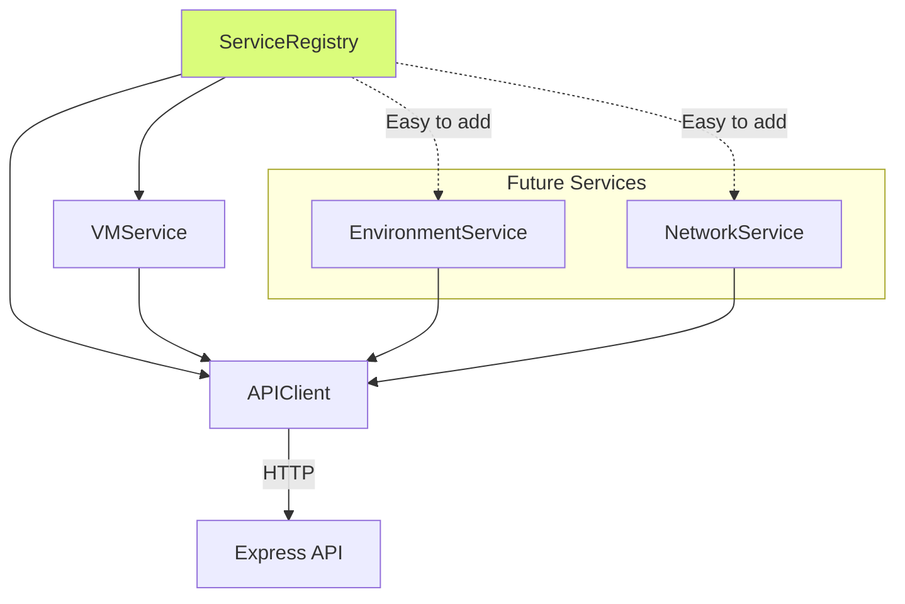
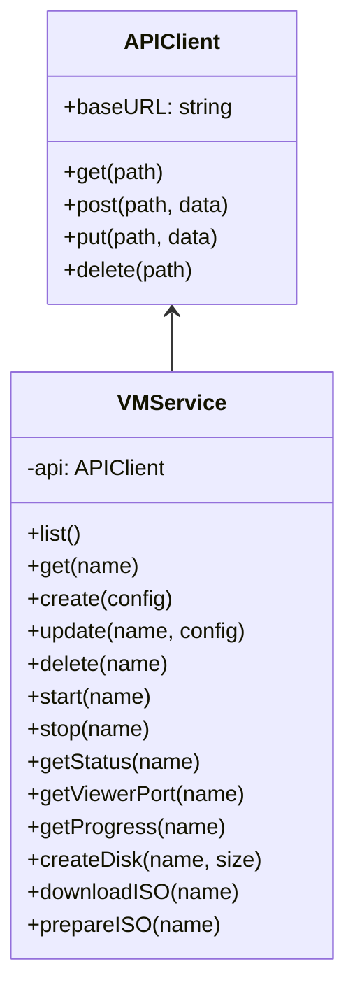
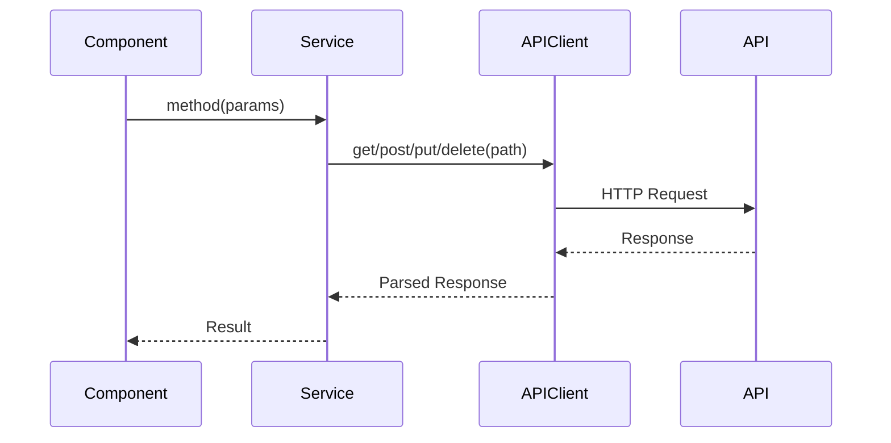
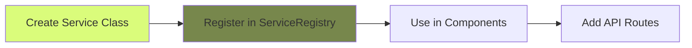

# Service Layer Architecture

## Service Registry Pattern

```mermaid
graph TB
    Registry[ServiceRegistry] --> APIClient[APIClient]
    Registry --> VMService[VMService]
    
    subgraph Future Services
        EnvService[EnvironmentService]
        NetService[NetworkService]
    end
    
    Registry -.->|Easy to add| EnvService
    Registry -.->|Easy to add| NetService
    
    VMService --> APIClient
    EnvService --> APIClient
    NetService --> APIClient
    
    APIClient -->|HTTP| Express[Express API]
    
    style Registry fill:#dafc7b
```

## Service Methods

```mermaid
classDiagram
    class APIClient {
        +baseURL: string
        +get(path)
        +post(path, data)
        +put(path, data)
        +delete(path)
    }
    
    class VMService {
        -api: APIClient
        +list()
        +get(name)
        +create(config)
        +update(name, config)
        +delete(name)
        +start(name)
        +stop(name)
        +getStatus(name)
        +getViewerPort(name)
        +getProgress(name)
        +createDisk(name, size)
        +downloadISO(name)
        +prepareISO(name)
    }
    
    APIClient <-- VMService
```

## Service Flow

```mermaid
sequenceDiagram
    participant Component
    participant Service
    participant APIClient
    participant API
    
    Component->>Service: method(params)
    Service->>APIClient: get/post/put/delete(path)
    APIClient->>API: HTTP Request
    API-->>APIClient: Response
    APIClient-->>Service: Parsed Response
    Service-->>Component: Result
```

## Adding New Service

```mermaid
graph LR
    A[Create Service Class] --> B[Register in ServiceRegistry]
    B --> C[Use in Components]
    C --> D[Add API Routes]
    
    style A fill:#dafc7b
    style B fill:#77874c
```

