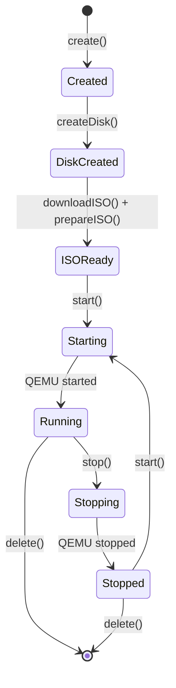
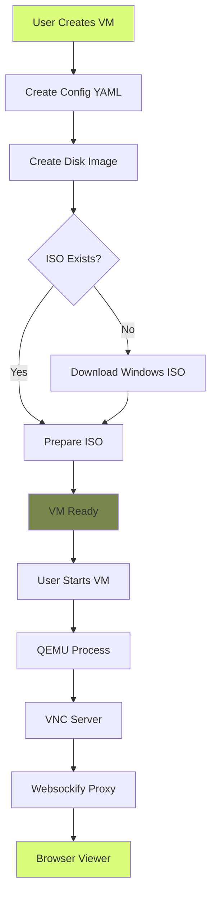
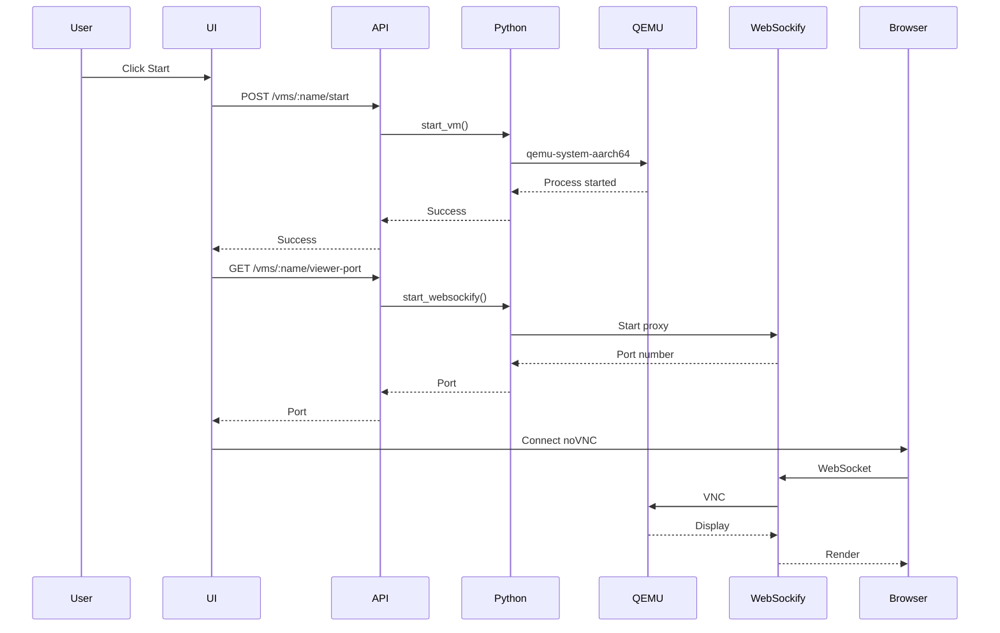
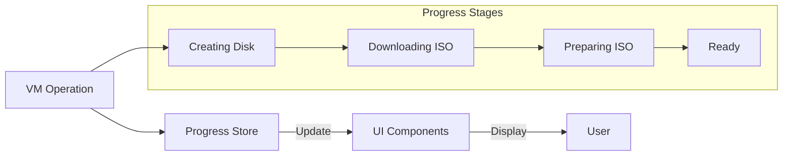
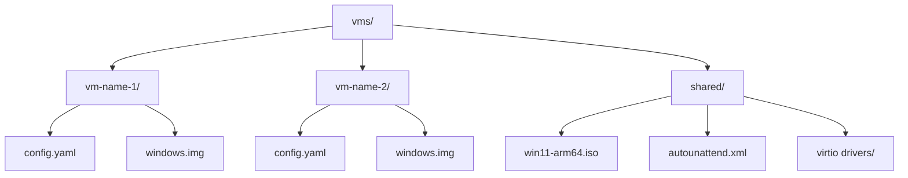

# VM Lifecycle

## VM States

```mermaid
stateDiagram-v2
    [*] --> Created: create()
    Created --> DiskCreated: createDisk()
    DiskCreated --> ISOReady: downloadISO() + prepareISO()
    ISOReady --> Starting: start()
    Starting --> Running: QEMU started
    Running --> Stopping: stop()
    Stopping --> Stopped: QEMU stopped
    Stopped --> Starting: start()
    Running --> [*]: delete()
    Stopped --> [*]: delete()
```

## VM Creation Workflow

```mermaid
graph TB
    Start[User Creates VM] --> Config[Create Config YAML]
    Config --> Disk[Create Disk Image]
    Disk --> Download{ISO Exists?}
    Download -->|No| DownloadISO[Download Windows ISO]
    Download -->|Yes| Prepare
    DownloadISO --> Prepare[Prepare ISO]
    Prepare --> Ready[VM Ready]
    Ready --> StartVM[User Starts VM]
    StartVM --> QEMU[QEMU Process]
    QEMU --> VNC[VNC Server]
    VNC --> WebSockify[Websockify Proxy]
    WebSockify --> Browser[Browser Viewer]
    
    style Start fill:#dafc7b
    style Ready fill:#77874c
    style Browser fill:#dafc7b
```

## VM Start Sequence

```mermaid
sequenceDiagram
    participant User
    participant UI
    participant API
    participant Python
    participant QEMU
    participant WebSockify
    participant Browser
    
    User->>UI: Click Start
    UI->>API: POST /vms/:name/start
    API->>Python: start_vm()
    Python->>QEMU: qemu-system-aarch64
    QEMU-->>Python: Process started
    Python-->>API: Success
    API-->>UI: Success
    UI->>API: GET /vms/:name/viewer-port
    API->>Python: start_websockify()
    Python->>WebSockify: Start proxy
    WebSockify-->>Python: Port number
    Python-->>API: Port
    API-->>UI: Port
    UI->>Browser: Connect noVNC
    Browser->>WebSockify: WebSocket
    WebSockify->>QEMU: VNC
    QEMU-->>WebSockify: Display
    WebSockify-->>Browser: Render
```

## Progress Tracking

```mermaid
graph LR
    Operation[VM Operation] --> Progress[Progress Store]
    Progress -->|Update| UI[UI Components]
    UI -->|Display| User[User]
    
    subgraph Progress Stages
        Disk[Creating Disk]
        Download[Downloading ISO]
        Prepare[Preparing ISO]
        Ready[Ready]
    end
    
    Operation --> Disk
    Disk --> Download
    Download --> Prepare
    Prepare --> Ready
```

## File System Structure

```mermaid
graph TB
    VMs[vms/] --> VM1[vm-name-1/]
    VMs --> VM2[vm-name-2/]
    VMs --> Shared[shared/]
    
    VM1 --> Config1[config.yaml]
    VM1 --> Disk1[windows.img]
    
    VM2 --> Config2[config.yaml]
    VM2 --> Disk2[windows.img]
    
    Shared --> ISO[win11-arm64.iso]
    Shared --> AutoUnattend[autounattend.xml]
    Shared --> Drivers[virtio drivers/]
```

